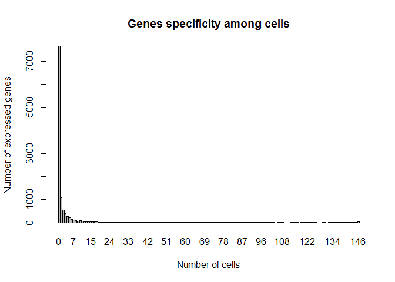
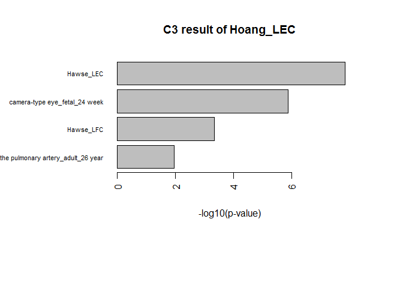
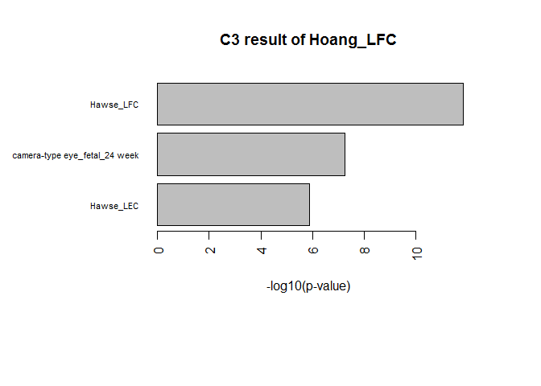

C3
================
Md Humayun Kabir

<!-- README.md is generated from README.Rmd -->
C3: An R package for cross-species compendium-based cell-type identification
============================================================================

Introduction
------------

This file contains the R code to run an example workflow for cell type identification of transcriptomic data using the C3 package. The package can help to identify the cell type or tissue of an unknown sample, based on it's transcriptome by comparing against a compendium of transcriptomes from different cell types and tissues.

The user makes their own compendium from a collection of transcriptomic data sets using the 'make\_gene\_expression\_compendium' function of the package. The user can add further transcriptomic samples to it using 'add\_sample\_into\_compendium' function into the compendium. Once all reference samples are added to the compendium, it is transformed into a marker gene compendium using the 'make\_marker\_gene\_compendium' function. At this stage the user can also add marker genes for additional reference samples using the 'add\_marker\_genes\_into\_compendium' function. For the unknown / query data, the user pre-processes the data using the 'preprocess\_querydata' function for gene ID conversion. Finally, the user performs gene set enrichment testing of the processed query data against the marker gene compendium to identify the possible cell type or tissue, using the 'c3\_test' function, and can visualise the results using the 'c3\_display\_result' function.

All the necessary data to run the example workflow are deposited in the C3 github repository <https://github.com/VCCRI/C3/tree/master/data>. These data are automatically loaded with the package. This may take some time during installation.

Please note that it is best to consistently pre-process both the compendium and query data before comparing them (Log normalisation, etc). Remember that micro-array data often requires extra normalisation steps (including background subtraction and quantile normalisation, or other methods). The c3 package does not perform such normalisations. In this example workflow we use non Log-normalised data.

Installation
------------

Make sure you have installed the packages 'devtools', 'biomaRt', 'slam' and 'xgsa', the commands to do so are as follows:

Open an R session and do the following:

``` r
source("http://bioconductor.org/biocLite.R")
biocLite("biomaRt")

install.packages('devtools')
devtools::install_github('VCCRI/XGSA')
install.packages("slam")
```

Then install the C3 package from github repository:

``` r
devtools::install_github('VCCRI/C3')
```

Finally load the packages with:

``` r
library(biomaRt)
library(xgsa)
library(slam)

library(c3)
```

Package installation and loading is done!

You are now ready to run the example.

Example
-------

In this workflow, we will ustilise the human ENCODE transcriptome data and associated labels (cell or tissue names) ([PMID:22955616](https://www.ncbi.nlm.nih.gov/pubmed/22955616)), Hoang et al. new born mouse lens transcriptomic data ([PMID:25489224](https://www.ncbi.nlm.nih.gov/pubmed/25489224)) and Hawse et al. adult human lens transcriptomic data ([PMID:15851978](https://www.ncbi.nlm.nih.gov/pubmed/15851978)) from the C3 github repository. The human ENCODE data is in the list format where each list element contains the replicate transcriptomes for a cell or tissue. The labels have the cell or tissue names matching the list elements.

First we will make a compendium from the human ENCODE data set and the descriptor data. Next we will add the Hawse et al. adult human lens transcriptomes to the compendium. This data contains the transcriptomic profile for both lens epithelial cells (LEC) and lens fiber cells (LFC). Then, we will convert the transcriptomes to a marker gene compendium that will contain only the uniquely\* highly expressed cell / tissue specific marker genes (\* = based on some thresholds). The Hoang et al. lens data contains the average expression values of 3 biological replicates for both LEC and LFC from the mouse. This data set will be used as the query data. We will pre-process the mouse lens query data and test it against the human compendium, to confirm the closest match to human cell types or tissues. Finally we will display the test results in a bar plot.

### Make human gene expression compendium from ENCODE data

The object 'human.encode.data' is a list of transcriptomic data and 'human.encode.data.descriptor' is a matching vector with tissue / cell type labels. The compendium will consist of a matrix of the average expression value of the replicates for each cell type and tissue, and the species of each data set as a vector. Here, the gene IDs of each sample in the compendium are 'ensembl\_gene\_id'.

``` r
human.compendium<-make_gene_expression_compendium(gene.expression.data = human.encode.data, species = "hsapiens", experiment.descriptor = human.encode.data.descriptor, expression.data.format = "list")
```

### Add Hawse et al. human lens transcriptome to the compendium

The Hawse et al. lens data ('hawse.human.lens.data') contains 2 different cell types and transcriptomes from 3 replicates in a single matrix. The column names for the replicate samples are not consistent, so we must provide a vector denoting the desired replicate groupings / cell / tissue labels. The gene IDs are imported as 'external\_gene\_name', so we must convert to 'ensembl\_gene\_id'.

``` r
Hawse.data.descriptor<-c("Hawse_LEC","Hawse_LEC","Hawse_LEC","Hawse_LFC","Hawse_LFC","Hawse_LFC")
Hawse.human.compendium<-add_sample_into_compendium(compendium.data = human.compendium, sample.data = hawse.human.lens.data, species = "hsapiens", data.format = "matrix", geneID = "external_gene_name", experiment.descriptor = Hawse.data.descriptor)
```

### Convert to a tissue / cell type specific marker gene compendium

We now convert the compendium to a set of uniquely\* highly expressed tissue / cell type specific marker genes (\* = based on some thresholds). We will set topExpGenes=500 (i.e. we will consider only the top 500 highly expressed genes as marker genes for each tissue / cell type in the compendium). During this processing step, a bar plot will display the frequency of highly expressed genes for each tissue / cell type. We will set the 'specific.cutoff' parameter value to 0.05 (i.e., a gene will be treated specific for a cell/tissue if it is highly expressed in less than 5% of total number of cells/tissues of the compendium).

``` r
human.marker.gene.compendium<-make_marker_gene_compendium(compendium.data = Hawse.human.compendium, specific.cutoff = 0.05, top.expressed.genes = 500)
```



### Pre-process the mouse lens transcriptome query data

The Hoang et al. mouse lens query data ('hoang.mouse.lens.data') contains average transcriptomes from 3 replicates in 2 separate cell types: LEC and LFC. This data is a matrix and as such will set the query data format to 'matrix'. As the matrix contains only two columns (average values of the replicates) for two cell types we will not provide the descriptor (labels) separately. This step will convert 'external\_gene\_name' to 'ensembl\_gene\_id' (and calculate the average expression value of the replicates for each tissue / cell type where appropriate). Gene ID conversion involves handling the biomaRt ensembl database and so can take a little while. We also now define the species of the query data.

``` r
Hoang.processed.query.data<-preprocess_querydata(cell.tissue.data = hoang.mouse.lens.data, species = "mmusculus", data.format = "matrix", geneID = "external_gene_name")
```

### C3 testing of mouse lens query vs. human marker gene compendium

We will now perform cross-species gene set enrichment testing of the query data against the human compendium using XGSA. There is one optional parameter 'topExpGenes' if you want to consider a different number of the highest expressed genes in the query sample than was considered in the compendium (this can be useful when comparing data from different platforms or gene universes for instance). There are two further optional parameters which are passed to XGSA: 'min' and 'max', indicating the minimum and maximum gene set size to be considered for testing. The result is in the form of a list with an element for each sample in the query data, with sub lists containing the XGSA 'pvalue's and the 'overlapGenes' generated by testing the query sample against each set of marker genes in the compendium.

``` r
Hoang.data.test.result<-c3_test(processed.queryData = Hoang.processed.query.data, marker.gene.compendium = human.marker.gene.compendium)
```

### Display C3 test result

To display the p-values of the significant test results we will use the 'c3\_display\_result' function. This function produces a barplot of the -log10 transformed significant pvalues. If there are no significant p-values the bar plot will display the top 10 non-significant results. You can also process and display the test result as you like by using the object returned by 'c3\_test'.

``` r
par(mar=c(10,10,5,5))
c3_display_result(Hoang.data.test.result)
```



    #> [1] "Hoang_LEC -- result plotting done!!"



    #> [1] "Hoang_LFC -- result plotting done!!"

### That's it! Now perform your own analyses using the "C3" package!!
